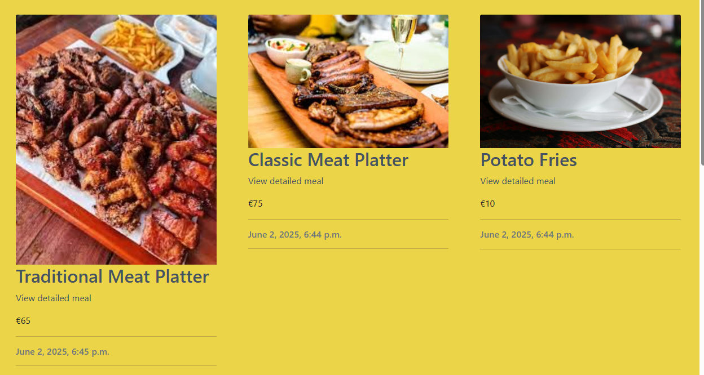
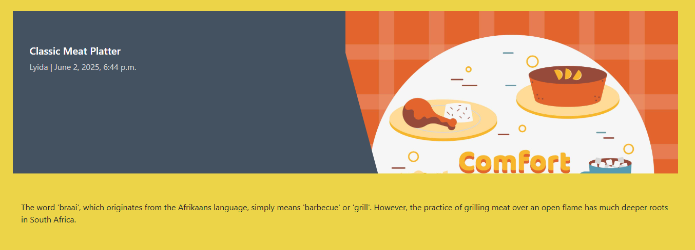
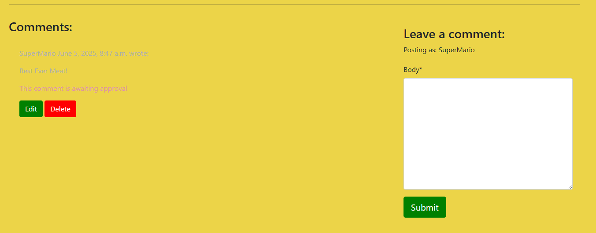
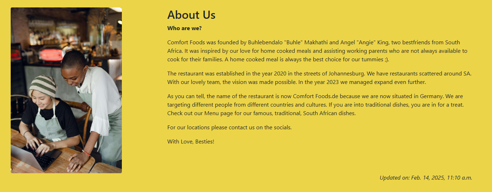
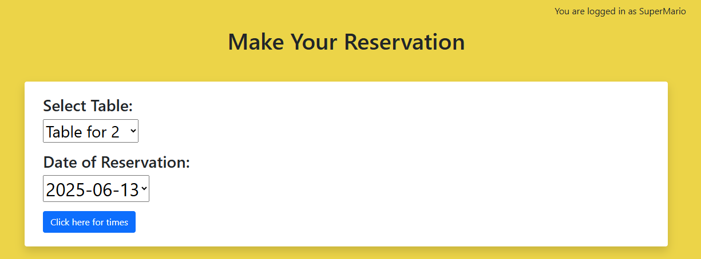
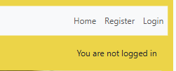
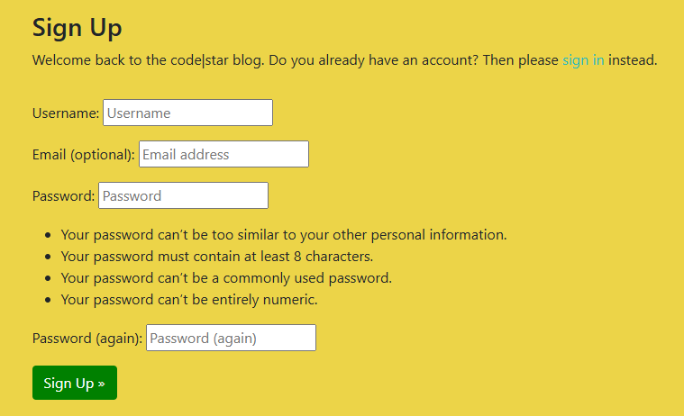

# Comfort Foods.de

Comfort Foods.de is a Restaurant Booking System. The site is for a restaurant that sells South African Food and it is based in Europe. The target market are people who come from Africa that have not indulged in the meals in a long time and also for tourists from around the globe that like to try new food from different cultures. Customers may use the site to make a booking to come visit the store. The restaurant does not allow walk-ins, strictly bookings are allowed. The aim of the restaurant is to allow people from different cultures to experience the warmth and love added into the dishes. The restaurant does not allow online ordering, customers would have to experience the meals inside the establishment.

## Features
### Navigation Bar
 - A customer uses the navigation bar to navigate around the site
 - Each link clicked directs the customer to a page where they can find more information
 - When a customer is not on the home page, they can click on the restaurant name to be redirected back to the menu.
 - A user can click the Reservation link at the top of any page to make a reservation.
 - The visible links on the navigation bar are only visible when a user is logged in. Please see below:

 

 - When a user is not logged in, the only links visble are as shown below:

 

### Home Page
 - This page has a callout message welcoming the user to the site
 - It has a carousel effect which shows a few of our dishes served at the restaurant
 - Below the images is a paragraph inviting users to signup in order to get rewards. Please see image below:

 
 
### Footer
 - Users can visit our social media sites to find out more information on a site
 - They can also contact us to make bookings. Please see below:

 

### Menu Page
  -	The menu page shows the types of meals and drinks offered at the restaurant.
  -	The restaurant offers the following: *Braai Platters* – meat platters that consist of different grilled meat types; *Hearty Meals* – consists of meals that are slowly cooked that bring comfort to the heart; *Sides* – these sides can be added to the hearty meals or Braai meat platters; and *Drinks* – these drinks are especially made in South Africa
  -	The menu shows the prices as well, so a customer is aware of what the meals cost. which allows them to be well prepared. Please see image below:

  
  
  - A user has the ability to view details of a meal by clicking 'View detailed meal' which will take them to a detailed page
  - This page with give the user a brief description of the history of the meal. Please see image below:

  

  - On the same page, a user is able to leave a comment on the meal once they have visited the restaurant. Please see below:

  

### About Us
  -	If a customer is logged in, they are able to read out the restaurants history
  -	The page also consist of an image of the founders
  
  
  

### Reservations Page
  -	This page is used to make reservations to visit the restaurant.
  -	In order for a customer to make a reservation, they would need to sign up and log in 
  -	A customer would have to select the date, time and as well a table with the number of people being booked.
  
  
  

### Logout Page
  - When a user logs out, the below pops up:

  

### Login Page
  - When a user is registered, they can simply login the site to browse. Please see below:
  
  
  

### Register Page
  - New users have to register in order to have access to the site. Please see below:

  
  

## Features to be implemented
  •	Offer home deliveries  
  •	Add more food to the menu

## Testing
  I have manually tested my code using PEP8 Python Validator.
  
  * There is an error due to long line that cannot be fixed.
  

## Deployment
  This project was deployed using Code Institute mock terminal for Heroku.

  * Steps for deployement
    - Ensure GitHub project has public visibility
    - Create a new Heroku App
    - Link the Heroku app to the repository
    - Click on Deploy

## Credits
  * For the better understanding of creating a Restaurant Booking System, 'I think therefore I blog' walkthrough.
  * Roman, Tutor CI, for assisting with how to create edit for comments
  * My Mentor, Moritz
  * Sarah, Tutor CI
  

