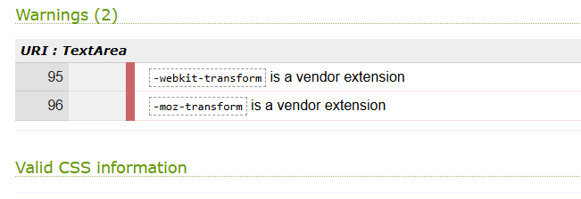

# Comfort Foods.de

Comfort Foods.de is a Restaurant Booking System. The site is for a restaurant that sells South African Food based in Europe. The target market are people who come from Africa that have not indulged in the meals in a long time and also for Europeans that like to try new food from different cultures. Customers have to order from the menu provided online and make reservations to book a table

## Features
### Navigation bar
 -	A customer uses the navigation bar to navigate around the site
 -	Each link clicked directs the customer to that page

 

### Home Page
 This page has a callout message welcoming the user to the site
 

### Menu Page
  o	The menu page shows our food menu as well as images of what is sold
  o	The menu has 4 categories, namely: Braai – meat platters that consist of grilled meat types; Hearty Meals – consists of meals that bring comfort to the heart; Sides – these sides can be added to the hearty meals or Braai meat platters; and Drinks – these drinks are especially made in South Africa
  o	A customer can select their food using the “select” button to order their food.
  o	When a customer is done selecting their meal, they can then click the “submit order” button where they will be redirected to a page to make a Reservation
  
### Reservations
  o	This page is used to make reservations to visit the restaurant.
  o	In order for a customer to make a reservation, they would need to sign up and log in 
  o	A customer would have to select the date, time and number of people being booked at the restaurant.
  o	A customer would then receive confirmation email
### About Us
  o	On this page a customer is able to read about the restaurant and about the founders
  o	If a customer would like to collaborate with us, they can complete the collaboration form
  

### Logout Page

### Login Page

### Register Page

## Features to be implemented
  •	Offer home deliveries  
  •	Add more food to the menu
