# Comfort Foods.de

Comfort Foods.de is a Restaurant Booking System. The site is for a restaurant that sells South African Food and it is based in Europe. The target market are people who come from Africa that have not indulged in the meals in a long time and also for tourists from around the globe that like to try new food from different cultures. Customers may use the site to make a booking to come visit the store. The restaurant does not allow walk-ins, strictly bookings are allowed. The aim of the restaurant is to allow people from different cultures to experience the warmth and love added into the dishes. The restaurant does not allow online ordering, customers would have to experience the meals inside the establishment.

## Features
### Navigation Bar
 - A customer uses the navigation bar to navigate around the site
 - Each link clicked directs the customer to a page where they can find more information
 - When a customer is not on the home page, they can click on the restaurant name to be redirected back to the menu.
 - A user can click the Reservation link at the top of any page to make a reservation.
 - The visible links on the navigation bar are only visible when a user is logged in. Please see below:

 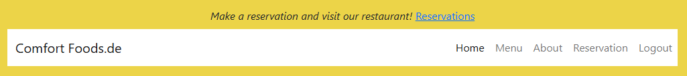

 - When a user is not logged in, the only links visble are as shown below:

 

### Home Page
 - This page has a callout message welcoming the user to the site
 - It has a carousel effect which shows a few of our dishes served at the restaurant
 - Below the images is a paragraph inviting users to signup in order to get rewards. Please see image below:

 
 
### Footer
 - Users can visit our social media sites to find out more information on a site
 - They can also contact us to make bookings. Please see below:

 

### Menu Page
  -	The menu page shows the types of meals and drinks offered at the restaurant.
  -	The restaurant offers the following: *Braai Platters* – meat platters that consist of different grilled meat types; *Hearty Meals* – consists of meals that are slowly cooked that bring comfort to the heart; *Sides* – these sides can be added to the hearty meals or Braai meat platters; and *Drinks* – these drinks are especially made in South Africa
  -	The menu shows the prices as well, so a customer is aware of what the meals cost. which allows them to be well prepared. Please see image below:

  
  
  - A user has the ability to view details of a meal by clicking 'View detailed meal' which will take them to a detailed page
  - This page with give the user a brief description of the history of the meal. Please see image below:

  

  - On the same page, a user is able to leave a comment on the meal once they have visited the restaurant. Please see below:

  

### About Us
  -	If a customer is logged in, they are able to read out the restaurants history
  -	The page also consist of an image of the founders
  
  
  

### Reservations Page
  -	This page is used to make reservations to visit the restaurant.
  -	In order for a customer to make a reservation, they would need to sign up and log in 
  -	A customer would have to select the date, time and as well a table with the number of people being booked.
  
  

  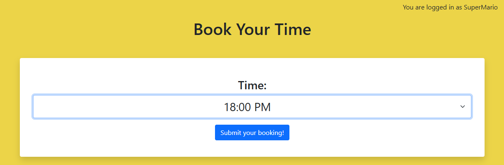

  - A user is redirected to the user panel page where they can view, edit and delete their booking
  - When a user clicks on the edit button, they will be redirected to the first reservation page where they can change times, dates and table service.

  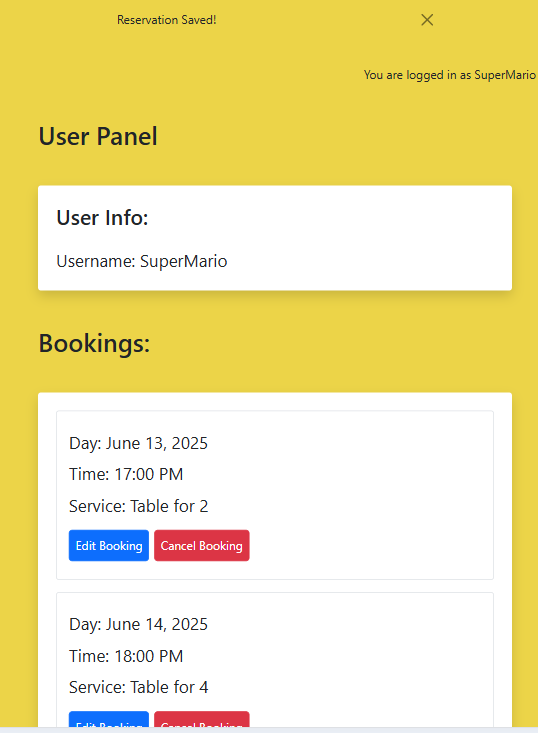
  

### Logout Page
  - When a user logs out, the below pops up:

  

### Login Page
  - When a user is registered, they can simply login the site to browse. Please see below:

  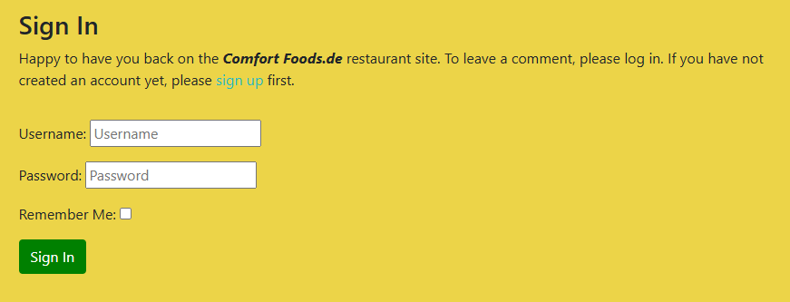
  

### Register Page
  - New users have to register in order to have access to the site. Please see below:

  
  

## Features to be implemented
  - Have a rewards page where users can view the amount of rewards hey have so they can get discounts depending on how often they visit the restaurant.
  -	Create a system to allow online bookings 
  -	Add more food to the menu
  - Add background images of food on all pages

## Testing
### Manual Testing
#### Register Page
  - The sign up form has a defensive design which does not allow a user to submit the form without filling out all required fields. Please see below:

  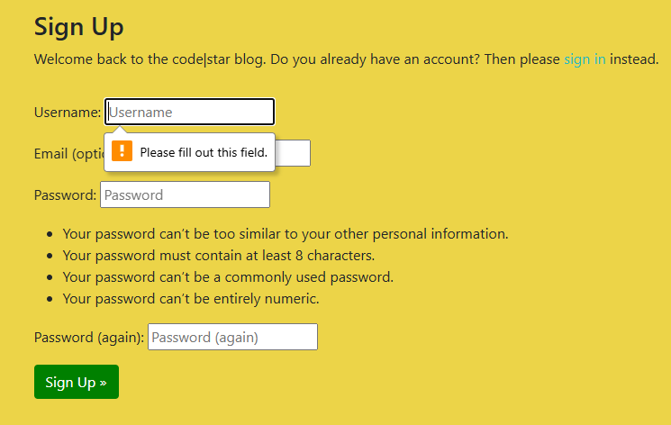

#### Login
  - When a user is logged in, a success message pops-up with the username.
  - There is another log in message that shows if a user is logged in or not

  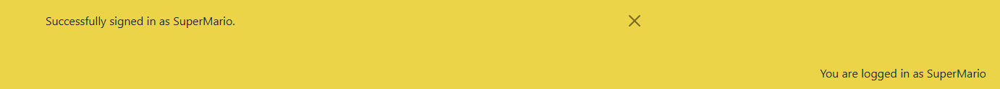

#### Detailed Menu
  - When a user clicks on the 'view detailed menu' link, the url changes
  - The menu has a paginate function that allows a user to view the next and previous page of the menu

  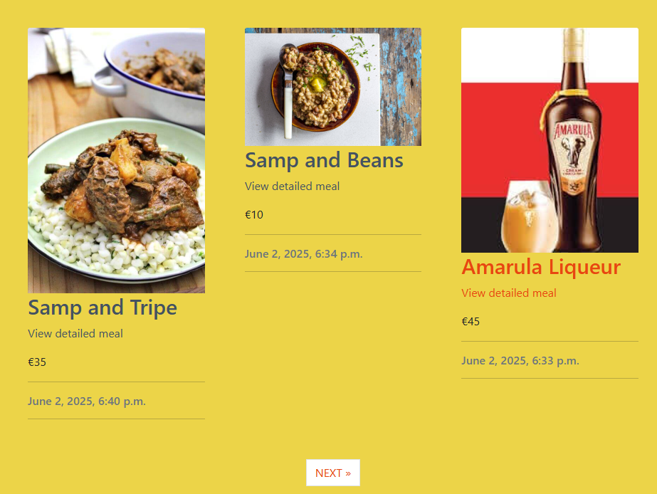

  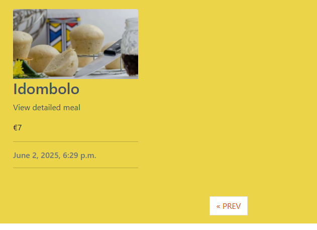

  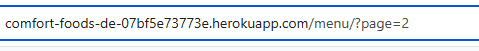

### Django Testing

##### Testing Reservation
##### *Table Booking*
  - I ran a test to for booking a table, at first it failed to due to the incorrect status code. Please see below:

  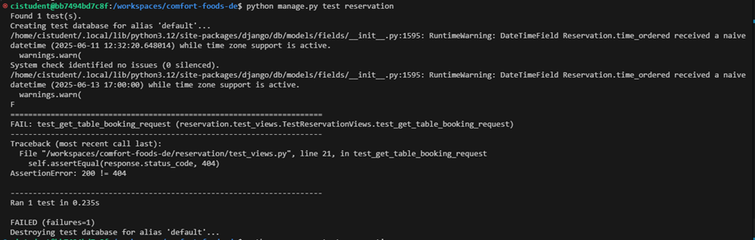

  - After reading the AssertionError message, I changed that piece of code to status_code 200. This time it passed. Please see below:

  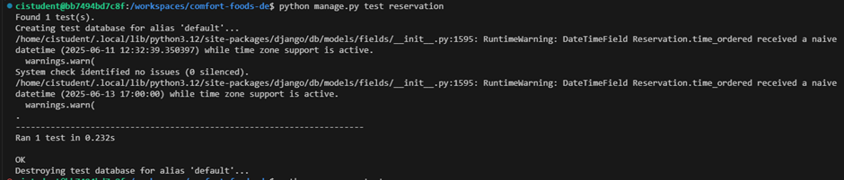

##### *Booking Submission*
  - I ran a test to see if a booking can be submitted without any issues, the test failed because I had written the day and time session incorrectly. Please see below:

  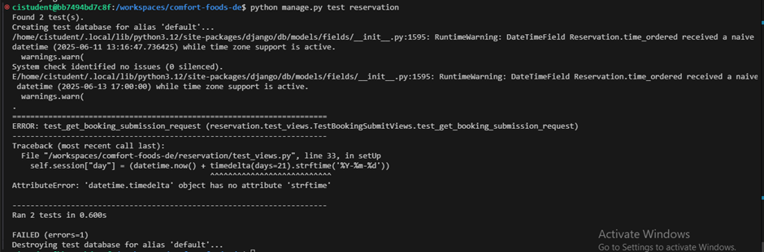

  - As soon as I fixed that issue by placing the brackets where they belong, another error arised. Instead of a 404 status code, I was supposed to put a status code 200. Please see below:

  

  - After changing the status code from 404 to 200, the test passed. Please see below:

  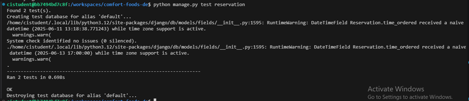

  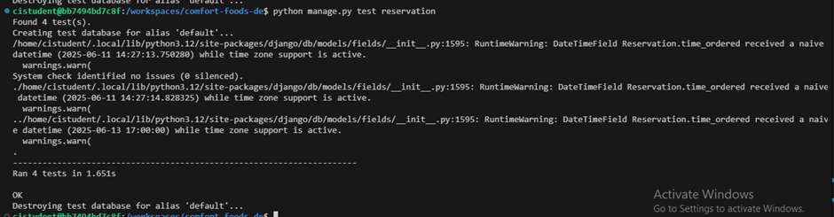

##### Testing Menu
##### *Menu Functionality*
  - I ran a test for the menu app to check if the customer form on menu detail is able to render, however it kept failing due to the category field that was not connected properly. Please see below: 

  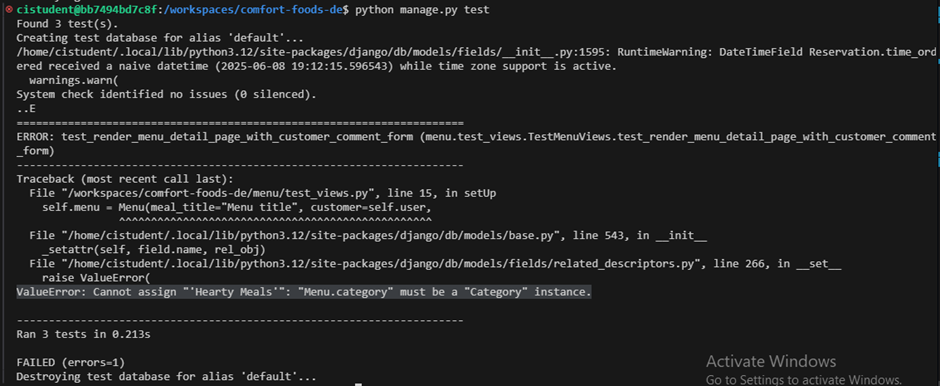

  - I then decided to remove the category as it was a field that was added in error. I encountered another issue, where I put an incorrect attribute on the testing fields. Please see below:

  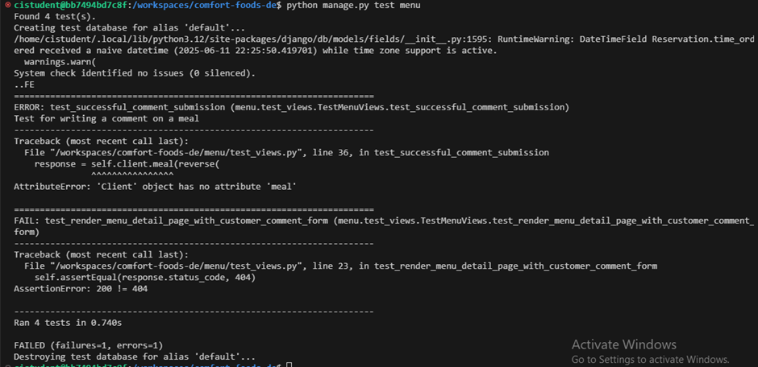

  - After adding the correct attribute, i got another error, AssertionError. Please see below:

  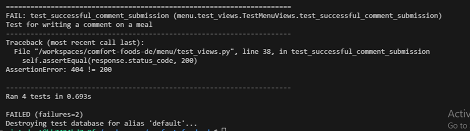

  - Finally, I fixed the AssertionError, my test passed. Please see below:

  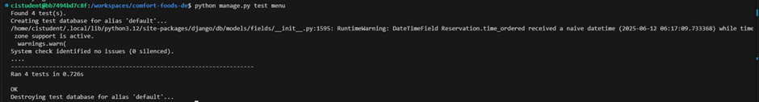

### Validator Testing
  - I have manually tested my code using PEP8 Python Validator.

  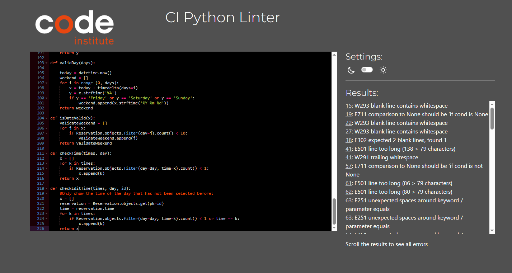
  
  * There is an error due to long line that cannot be fixed.
  

##### *About App*
  * The about views had an indentation issue. Please below:

  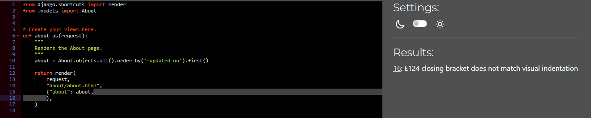

  * After fixing the indentation, the below is the result:

  

### Planning Project
  - I used Balsamiq to plan my project. Please see below images:

  * About Page

  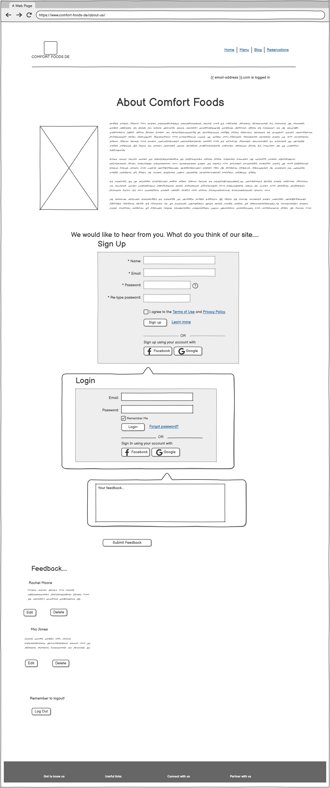

  * Home Page

  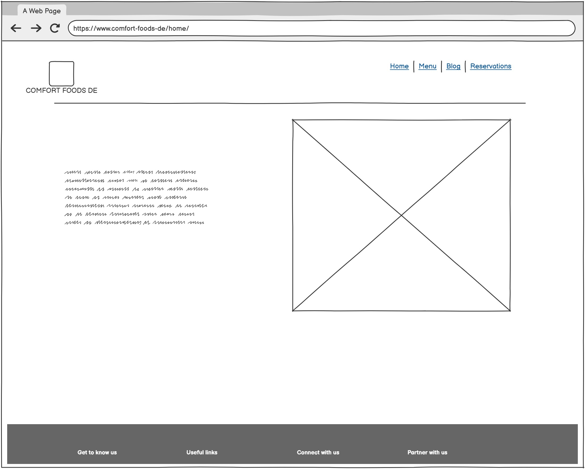

  * Menu Page

  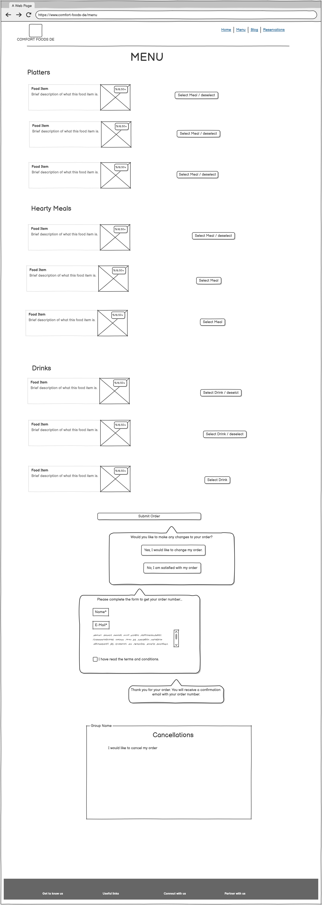

  * Reservation Page

  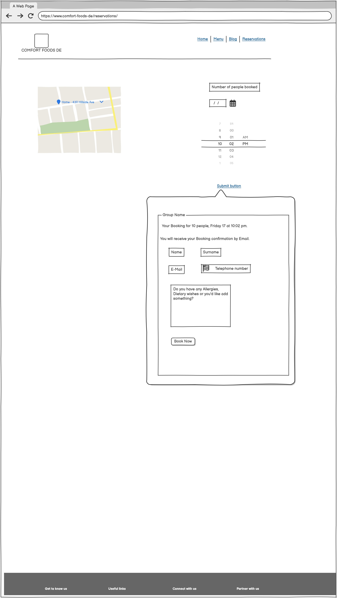

## Bugs
#### Home Page
  - At the beginning of building the project, it was doing well. Please see below:
  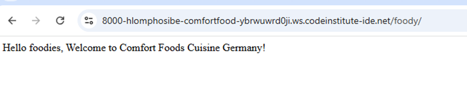

  - Images did not want to appear on the preview. Please see below:
  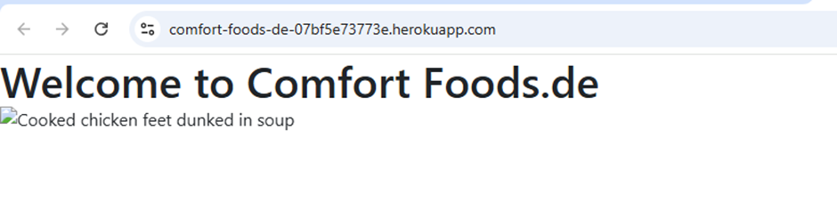

#### Github issues
  - I could not push my project to GitHub. Please see below:

  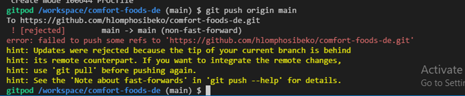

  - I managed to fix the issue using commands from the workspace terminal. Please see below:

  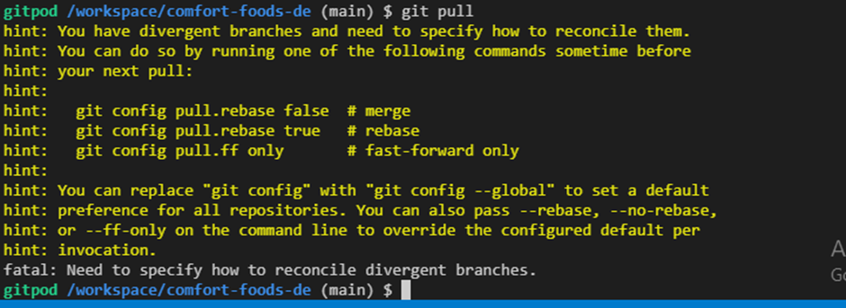

## Unfixed Bugs

## Deployment
  This project was deployed using Code Institute mock terminal for Heroku.

  * Steps for deployement
    - Create a repository on GitHub
    - On VS-code, connect the repository with the workspace and use git push command to push work into GitHub
    - Ensure GitHub project has public visibility on Github
    - Create a new Heroku App
    - Create configuration variables to connect the VS-Code with Heroku
    - Link the Heroku app to the GitHub repository
    - Click on Deploy

## Credits
### Content
  * For the better understanding of creating a Restaurant Booking System, I used google to search for restaurants. The one restaurant that stood out for me was [Amrit-Restaurant](https://amrit.de/en/)
  * For a better understanding of how to create such a website I used the CI walkthrough, 'I think therefore I blog'.
  * Roman, Tutor CI, for assisting with how to create edit for comments
  * My Mentor, Moritz, helped with figuring out how to connect the views on the reservation page
  * Rebecca, Tutor CI, helped me with authentication as I could not hide some links when user is not logged in.
  * For a better understanding on how to add category to views, I used [W3Schools](https://www.w3schools.com/django/django_queryset_orderby.php)

### Media
  * For a better understanding of how a reservation system works, I used a video and code from John Abdsho Khosrowabadi [Reservation Tutorial](https://blog.devgenius.io/django-tutorial-on-how-to-create-a-booking-system-for-a-health-clinic-9b1920fc2b78)
  * The image on the About page was taken from [pexels](https://www.pexels.com/search/best%20friends%20in%20front%20of%20restaurant/)
  * The images on the menu were taken from various site: [Logo](https://www.freepik.com/vectors/comfort-food); [Appletise](www.nkanyihouse.com); [Meat platter](www.ngunifoods.co.za); [Meat platter](www.instagram.com_spazaeats)

  

